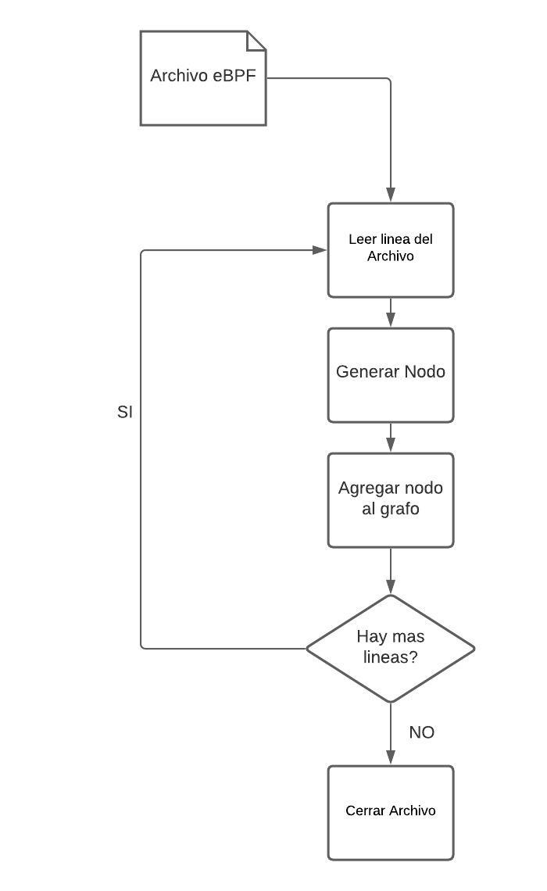

# TP2 - Verificador eBPF
## Taller de Programación I - 2c 2020

| Nombre y Apellido | Padrón | 
| ----------- | ----------- |
| Daniela Genaro | 103440 |

Link al repositorio: https://github.com/danielagenaro98/tp2

En el presente trabajo se implementó un programa el cual actua como Verificador de archivos eBPF. En el mismo, dado un archivo eBPF se contruye un grafo para poder analizarlo con DFS y concluir si el archivo posee ciclos o instrucciones sin usar. Además, el procesamiento se realiza en paralelo utilizando N hilos de ejecución especificados como input del programa.

A continuación se explicaran los rasgos generales de diseño del trabajo realizado.

# Diseño:

El trabajo se dividió en dos grandes étapas, las cuales internamente se fueron dividiendo en etapas más pequeñas para facilitar el proceso, las mismas fueron:

## Generar el grafo:
En esta etapa el objetivo fue generar una lista de listas o matriz la cual contenga las instrucciones del archivo dado. Para almacenar estas instrucciones se decidió generar un módulo el cual pueda procesar las lineas ingresadas y obtener una estructura parseada. 
Una vez obtenido esto, se procedió a implementar el algoritmo DFS mediante el cual se realiza la verificación del grafo.

 

Cliente

 

## Procesamiento en paralelo:
Una vez obtenido el grafo junto con el correcto funcionamiento del algoritmo DFS se procedió a implementar la ejecución en paralelo mediante la utilización de Threads. Para obtener un correcto funcionamiento del proceso, se tuvo que tener encuenta qué modulos proteger y cuales no. 
En esta etapa se realizaron 3 módulos los cuales se describen a continuación:

1) Manejador de Archivos, con el cual se proporcionarán los archivos a verificar con los hilos.
2) Impresor, con el cual se mostraran todos los resultados por salida estandar.
3) Thread, con el cual se crearan los hilos que realizaran el procesamiento de los archivos.
